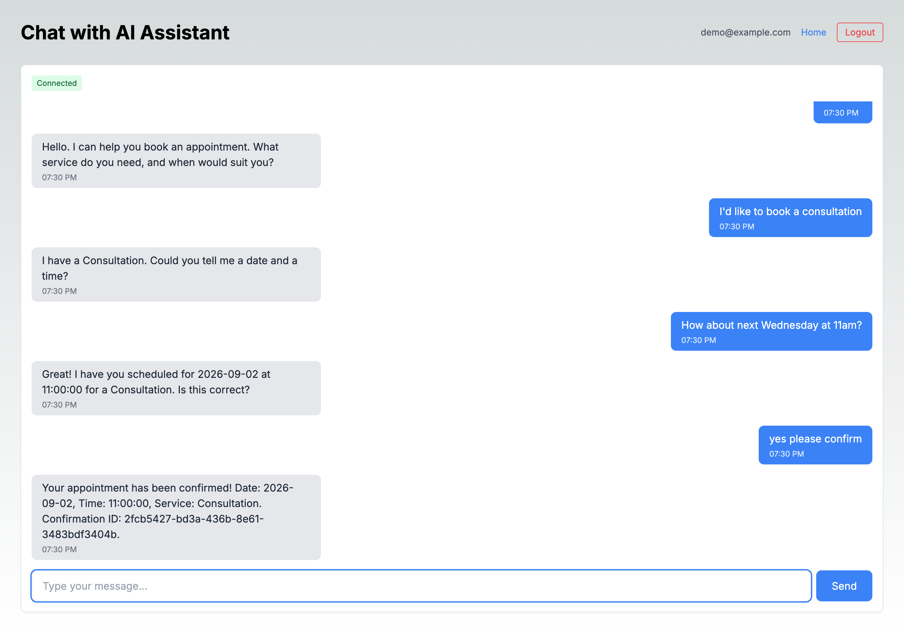
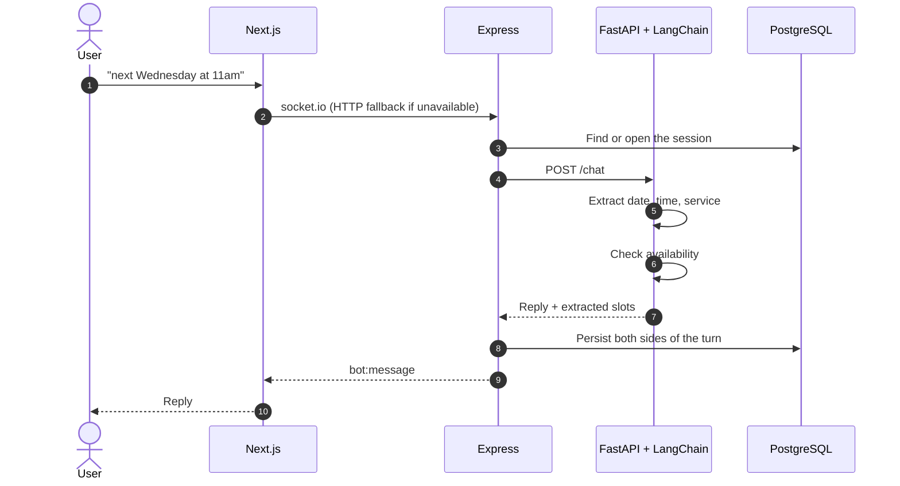
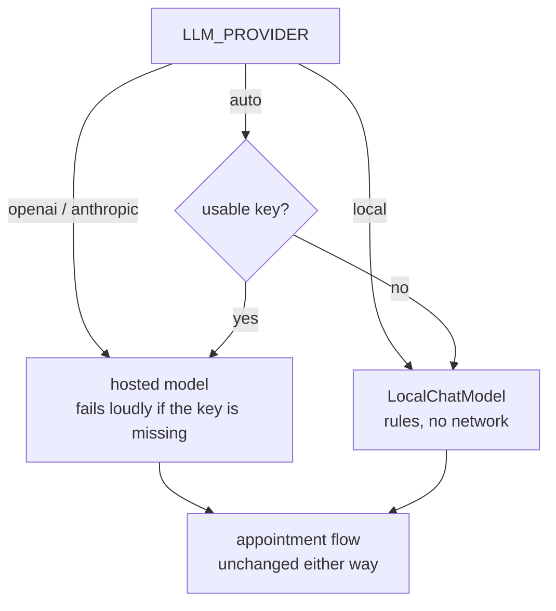

# AI Appointment Booking Assistant

A three-service system that books appointments through conversation. Type
"I'd like a consultation next Wednesday at 11am" and it fills in the missing
details, checks availability, refuses a double booking, and confirms.

Next.js frontend, Node/Express backend, Python/FastAPI AI service, PostgreSQL.

**It runs with no API key.** That was the main piece of work: the AI service
previously raised in its constructor without `OPENAI_API_KEY`, so nothing —
not the service, not the tests — would start without a billing relationship.

---

## Run it

```bash
cd TeraLeads
cp .env.example .env
docker compose up -d --build
```

| | |
|---|---|
| Chat UI | http://localhost:3400 |
| Backend API | http://localhost:3401 |
| AI service docs | http://localhost:8400/docs |

Copying `.env.example` unchanged gives you a working system: `LLM_PROVIDER=auto`
picks a hosted model when a key is present and the local rule-based model when
one is not. Add an `OPENAI_API_KEY` to switch; nothing else changes.



That conversation is the local model. No network call left the machine.

---

## How a message travels



Steps 4 and 8 did not exist. The backend's chat handler read:

```js
// TODO: Forward message to AI microservice
// For now, return a placeholder response
const response = { message: 'This is a placeholder response. AI service integration pending.' }
```

The three-service architecture the old README described was never connected.
The browser talked to the backend, and the backend talked to nobody — every
message in the UI came back as that placeholder string.

---

## Running without a key

`LLMProvider` now selects a backend instead of demanding one:



`LocalChatModel` is a real LangChain `BaseChatModel`, not a stub returning a
fixed string. It implements both things the booking flow asks of a model:
`invoke` for replies, and `with_structured_output(AppointmentExtraction)` for
pulling the date, time and service out of a turn — which is what lets the flow
run unmodified against either backend.

It extracts with explicit patterns and, crucially, **abstains rather than
guessing**. An unrecognised service or an ambiguous time comes back as `None`,
which makes the flow ask for it. A booking assistant that invents an
appointment time is worse than one that asks a second question.

| | Hosted model | Local |
|---|---|---|
| Phrasing it handles | Anything | The patterns it was given |
| Unrecognised input | Infers | Returns `None`, flow asks |
| Cost | Per message | Zero |
| Slot filling, availability, double-booking, persistence | Identical | Identical |

What offline mode proves: the conversation state machine, slot filling, the
availability check, the double-booking guard, persistence and the backend
hand-off all work end to end. What it does not prove: how the system handles
phrasing nobody anticipated. That is what the hosted model is for, and it is
why this sits behind the same interface rather than replacing anything.

### The placeholder-key trap

`.env.example` shipped `OPENAI_API_KEY=your-openai-api-key-here`. That value is
not empty, so a naive "is a key set?" check selects OpenAI and the first
message fails with a 401 from the vendor — an error that points nowhere near
the actual cause. Placeholder values are now recognised as *absent*:

```python
_PLACEHOLDER_MARKERS = ("your-", "changeme", "xxx", "<", "api-key-here", ...)
```

Asking for a vendor explicitly still fails loudly. An explicit request should
never silently become something else.

---

## What was broken

Everything below was found by trying to run the thing the README told people
to run.

**The backend image could not build.** Its Dockerfile ran
`npm ci --only=production=false` — npm rejects that flag ("Must be one of:
null, prod, production") and ignores it — and `npm ci` requires a lockfile.
There was none. Worse, `package-lock.json` was listed in **both** `.gitignore`
and `.dockerignore`, so the lockfile `npm ci` requires was guaranteed absent by
construction. Lockfiles are now committed: this is an application, not a
library, and a reproducible install is the point.

**The frontend image could not build.** It copied `/app/public`, which did not
exist, and then started `node .next/standalone/server.js` — the path inside the
*builder* stage. After `COPY .next/standalone ./`, the entry point is at
`/app/server.js`.

**The browser called the wrong port.** `NEXT_PUBLIC_*` values are inlined into
the client bundle at build time; compose passed them as runtime environment
variables, which has no effect on the shipped JavaScript. They are build args
now.

**CORS blocked every request.** The backend allowed one origin, the frontend
was served from another, so login failed in the browser while working perfectly
from curl.

**Every chat message returned 500.** The frontend generates an opaque string
session id (`session-1788185187684-o6q91ysip`); the backend passed it straight
to a lookup against `chat_sessions.id`, a `SERIAL` integer. Postgres raised
`invalid input syntax for type integer`. The client's key is now stored
alongside the row and the integer id stays internal — and `findById` treats a
non-numeric id as a miss rather than a database error.

**The WebSocket never connected.** The frontend shipped a complete socket.io
client — auth handshake, reconnection, `message` / `chat:message` /
`bot:message` events — and the backend had no socket.io server and no socket.io
dependency. Every handshake 404'd, so the UI sat permanently on
"Reconnecting..." and silently fell back to HTTP. The server half is now
implemented, with JWT authentication on the handshake rather than per-event.

---

## Tests

```bash
# AI service — 70 tests
cd TeraLeads/chatbot-ai
docker run --rm -v "$PWD":/w -w /w -e PYTHONPATH=/w/src teraleads-ai-service \
  python -m pytest tests/ -q

# Backend — 48 tests
cd TeraLeads/chatbot-backend
docker run --rm -v "$PWD":/w -w /w node:18-alpine \
  sh -c 'npm ci --include=dev && npx jest'
```

Up from 26 and 41. The new tests concentrate on what was actually broken:

- **Extraction is conservative** — an unknown service, an ambiguous time and a
  date fragment inside `2026-03-14` all return `None` rather than a guess.
- **Provider selection** — no key, an empty key and a placeholder key all
  select local; an explicit vendor request with no key raises.
- **The chat turn handler** — that a turn reaches the AI service at all, that
  the lookup uses the client key rather than the integer id, and that a failure
  propagates rather than becoming an invented reply.

One of these caught a bug while being written: `extract_date("next friday")`
returned *this* Friday, because the offset was already non-zero and
`ahead or 7` left it unchanged.

---

## Layout

```
TeraLeads/
├── chatbot-frontend/     Next.js 14, Redux, socket.io client
├── chatbot-backend/      Express, JWT, PostgreSQL
│   └── src/
│       ├── realtime.js       socket.io server (was missing)
│       ├── services/
│       │   ├── aiClient.js       calls the AI service (was a TODO)
│       │   └── chatbot.service.js
│       └── models/ChatSession.js
└── chatbot-ai/           FastAPI + LangChain
    └── src/llm/
        ├── provider.py       backend selection
        └── local_model.py    keyless LangChain chat model
```

## Configuration

| Variable | Default | Purpose |
|---|---|---|
| `LLM_PROVIDER` | `auto` | `auto`, `openai`, `anthropic`, `local` |
| `OPENAI_API_KEY` | empty | Present and real ⇒ hosted model |
| `AI_SERVICE_URL` | `http://ai-service:8000` | Where the backend forwards turns |
| `CORS_ORIGIN` | `http://localhost:3400` | Must match the frontend's port |
| `FRONTEND_PORT` / `BACKEND_PORT` / `AI_PORT` | 3400 / 3401 / 8400 | Host ports |

## Known limitations

- **The local model only knows the phrasings it was given.** That is the
  design — it asks rather than guessing — but it is not a language model, and
  anything unusual becomes a clarifying question.
- **Appointments live in two places.** The AI service keeps a JSON store and
  the backend has a `appointments` table; they are not reconciled. One of them
  should own the booking.
- **No timezone handling.** Times are naive, which is wrong the moment a user
  and a business are in different zones.
- **`socket.io` has no room or presence model.** One socket per user, replies
  go back to the sender only.
- **The landing page is a title and two buttons.** The chat screen is the
  product; the rest of the UI is scaffolding.
